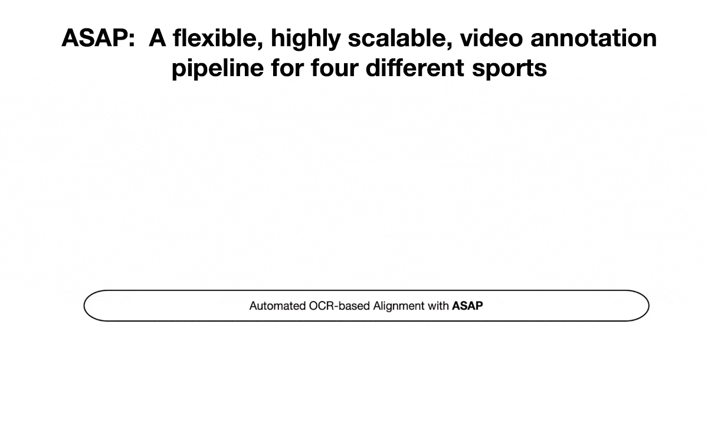

# Building Scalable Video Understanding Benchmarks through Sports
Implementation of the ASAP pipeline for sports videos. 



## Usage
For usage of this pipeline, first please install the [Google Vision API](https://cloud.google.com/vision) in your local env.

Firstly, scrape through the cricinfo website using `scrape_espn.ipynb` and follow the instructions specified there. For generating LCric, we use [ESPNCricinfo](https://www.espncricinfo.com/).

Next, please place the match videos directory. The overall directory structure can be seen as follows:

    .
    ├── config                   # config files for match videos
    │   ├── ...
    ├── videos                   # All match videos can be put here         
    │   ├── ...               
    ├── images                   # auto generated metadata when pipeline is run
    │   ├── ...
    ├── files                    # auto generated metadata when pipeline is run
    │   ├── ...                  
    ├── main.py                  
    ├── ocr_utils.py
    ├── get_reference_frame.py
    ├── create_annotations.py
    ├── convert_vid_to_imgs.py
    ├── convert_to_srt.py
    ├── video_utils.py
    ├── scrape_espn.ipynb
    ├── README.md
    .


For running the pipeline, once the directory structure is created and scraping is done, execute this:

```
python main.py
```


## Some TODOs

- [x] Release the pipeline for creation of LCric Dataset.
- [ ] Release the pipeline for creation of sports like Football, Baseball, Basketball.
- [ ] Make the pipeline more generalizable, usage of a single pipeline for these 4 sports.
